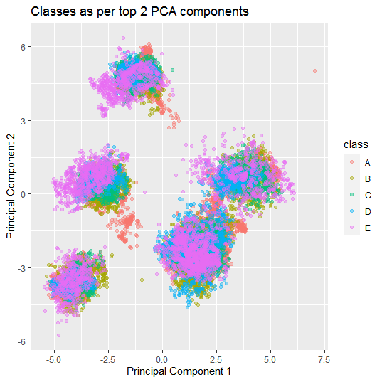

### 1. Data Source:

The data for this analysis has been obtained from 'Practical Machine Learning' course offered by John Hopkins University on Coursera. 

The course in turn has sourced the data from [Velloso, E.; Bulling, A.; Gellersen, H.; Ugulino, W.; Fuks, H. Qualitative Activity Recognition of Weight Lifting Exercises. Proceedings of 4th Augmented Human (AH) International Conference in cooperation with ACM SIGCHI (Augmented Human'13) . Stuttgart, Germany: ACM SIGCHI, 2013](http://web.archive.org/web/20161217164008/http://groupware.les.inf.puc-rio.br/work.jsf?p1=11201)

### 2. Introduction:

The growth of fitness tracking gadgets has led to a movemment of 'quantified self' wherein tech and fitness enthusiasts monitor the quality and quantity of their physical activity to achieve their fitness goals. The [study above](http://web.archive.org/web/20170519033209/http://groupware.les.inf.puc-rio.br/public/papers/2013.Velloso.QAR-WLE.pdf) has its focus on the quality aspect of those physical activities. <br>

Specifically, the study has analyzed and collected data for weight lifting exercises. The data has five target classes viz. `A`, `B`, `C`, `D` and `E`. Class `A` corresponds to the correct method of a weight lifting exercise while the other classes correspond to erroneous methods. The features for these classes are different body measurements obtained through digital gadgets. A detailed overview of the features can be found [here](http://web.archive.org/web/20170519033209/http://groupware.les.inf.puc-rio.br/public/papers/2013.Velloso.QAR-WLE.pdf) 

In this paper, we shall examine this data to build a ML classifier to classify the above six classes. Columns `1:7` in the data have been dropped as they correspond to row numbers, subject names and timestamps of observations making these columns irrelevant to our classification problem.


```r
train_data_url <- 'https://d396qusza40orc.cloudfront.net/predmachlearn/pml-training.csv'
test_data_url <- 'https://d396qusza40orc.cloudfront.net/predmachlearn/pml-testing.csv'
train_data_path <-  '.\\Project_data\\train_data.csv'
test_data_path <- '.\\Project_data\\test_data.csv'

if(!file.exists(train_data_path))
    {
        download.file(url=train_data_url, destfile=train_data_path, method='curl')    
    }
if(!file.exists(test_data_path))
    {
        download.file(url=test_data_url, destfile=test_data_path, method='curl')    
    }
train_data <- fread(train_data_path, drop=1:7)
test_data <- fread(test_data_path, drop=1:7)
```

### 3. Exploratory Data Analysis:

a) **Overview of the Data:**
* The test dataset is without class information and thus it will be used for prediction once the classifier is built.
* We will split our train data into training and validation sets for building our classifier. As the number of samples is quite large, we shall reserve only 5% (979 samples) of our train dataset for validation.<br>


```r
set.seed(333)
inTrain <- createDataPartition(train_data$classe, p=0.95, list=FALSE)
training <- train_data[inTrain,]
validation <- train_data[-inTrain,]
```

    
b) **Cleaning the Data:**
* The dimensions of the dataset and the number of samples in each `classe` are as shown below.
* Next, we will figure out the features which have more than 5% of their values missing. We already have a rich feature space of 153 variables. Removing variables with high percentage of missing values would help us avoid imputation biases.
* Since, no `NA` values are left, no imputation strategy is needed.


```r
dim(train_data)
```

```
[1] 19622   153
```

```r
table(train_data[,classe])
```

```

   A    B    C    D    E 
5580 3797 3422 3216 3607 
```

```r
na_percentage <- training[,lapply(.SD, function(x) sum(is.na(x))/.N >0.05)]
cols_to_drop <- which(as.logical(na_percentage))

training[, c(cols_to_drop):=NULL]
validation[, c(cols_to_drop):=NULL]
test_data[, c(cols_to_drop):=NULL]

training[, classe:=as.factor(classe)]
validation[, classe:=as.factor(classe)]

dim(training)
```

```
[1] 18643    53
```

```r
sum(is.na(training))
```

```
[1] 0
```

```r
sum(is.na(validation))
```

```
[1] 0
```


c) **Dimensionality Reduction:**
* We will now analyze our remaining 53 features. We shall first check if some features have near zero variance. The code below gives the count of number of variables having near zero variance. However, in our case there is no variable with near zero variance. Hence, we can not reduce dimensionality at this step.


```r
nsv <- nearZeroVar(training, saveMetrics = TRUE)
sum(nsv$nzv==TRUE)
```

```
[1] 0
```

* Next, we will find the correlations among the 53 feautres. Several variables are highly correlated. The code below gives the count of variables that have correlation of 0.75 or more with any other variable.


```r
descrCor <- cor(training[,!c('classe')])
length(findCorrelation(descrCor, cutoff = .75))
```

```
[1] 21
```

* We can either straightaway remove the above features or we can employ a dimensionality reduction technique. In this paper, we employ Principal Component Analysis (PCA) to reduce the dimensionality of our data. Principal Components which together explain atleast 80% of the variance in the feature space have been retained. Thus, by the virtue of PCA, our feature space reduces to 12 variables.


```r
preProc <- preProcess(training[,!'classe'], method = 'pca', thresh = 0.8)
training_transformed <- predict(preProc, training[,!'classe'])
validation_transformed <- predict(preProc, validation[,!'classe'])
test_transformed <- predict(preProc, test_data[,!'problem_id'])
preProc$numComp
```

```
[1] 12
```


d) **Visualizing Features:**
* Herein, we will visualize how the Top 2 Principal components separate the five classes.
* The separation is not very distinct, especially for class E. 
* However, the graph uses only two Principal components. With all 12 components and a ML classifier, we aim to get a much better classification.


```r
g <- ggplot()+
    geom_point(mapping = aes(x=training_transformed$PC1, 
                             y=training_transformed$PC2,
                             col=training$classe), alpha=0.4) +
    labs(x='Principal Component 1', 
         y='Principal Component 2',
         title='Classes as per top 2 PCA components', 
         color='class')
print(g)
```



### 4. Building Classifier:

a) **Cross Validation:**
* A five fold cross-validation strategy has been adopted.


```r
fitControl <- trainControl(method = 'cv', number = 5)
```

b) **Classifer:**
* Two classifiers viz. K-Nearest Neighbour(KNN) and Random Forest(RF) are fitted to the `training_transformed` data. Random Forest provides higher accuracy on the validation dataset. Hence, RF classifier has been chosen for our predictions.
* RF Classifier was expected to perform better as it enables bootstrapping of both samples and features.


```r
set.seed(111)
knn_classifier <- train(x=training_transformed, 
                        y=training$classe, 
                        method='knn',
                        trControl = fitControl)

knn_predictions <- predict(knn_classifier, validation_transformed)
knn_cm_matrix <- confusionMatrix(validation$classe, knn_predictions)
knn_cm_matrix$overall
```

```
      Accuracy          Kappa  AccuracyLower  AccuracyUpper   AccuracyNull 
     0.9509704      0.9379460      0.9355165      0.9636314      0.2900919 
AccuracyPValue  McnemarPValue 
     0.0000000            NaN 
```

```r
set.seed(222)
rf_classifier <- train(x=training_transformed, 
              y=training$classe, 
              method='rf',
              ntree = 400,
              trControl = fitControl)

rf_predictions <- predict(rf_classifier, validation_transformed)
rf_cm_matrix <- confusionMatrix(validation$classe, rf_predictions)
rf_cm_matrix$overall
```

```
      Accuracy          Kappa  AccuracyLower  AccuracyUpper   AccuracyNull 
     0.9693565      0.9612287      0.9565419      0.9792314      0.2860061 
AccuracyPValue  McnemarPValue 
     0.0000000            NaN 
```

c) **Confusion Matrix Table:** 

* Confusion Matrix Table for Validation Set is as shown below


```r
rf_cm_matrix$table
```

```
          Reference
Prediction   A   B   C   D   E
         A 272   3   2   2   0
         B   3 182   3   0   1
         C   2   2 162   2   3
         D   3   0   2 154   1
         E   0   0   0   1 179
```


### 5. **Conclusion:**

a) **Out of Sample Predicted Error:**

* The out of sample predicted error rate is:


```r
1 - rf_cm_matrix$overall[['Accuracy']]
```

```
[1] 0.03064351
```

b) **Predictions for unseen Test Set:**

* The class predictions for the unseen test are:


```r
data.table(problem_id=1:20, 
           class=predict(rf_classifier, test_transformed))
```

```
    problem_id class
 1:          1     B
 2:          2     A
 3:          3     A
 4:          4     A
 5:          5     A
 6:          6     E
 7:          7     D
 8:          8     B
 9:          9     A
10:         10     A
11:         11     B
12:         12     C
13:         13     B
14:         14     A
15:         15     E
16:         16     E
17:         17     A
18:         18     B
19:         19     B
20:         20     B
```


